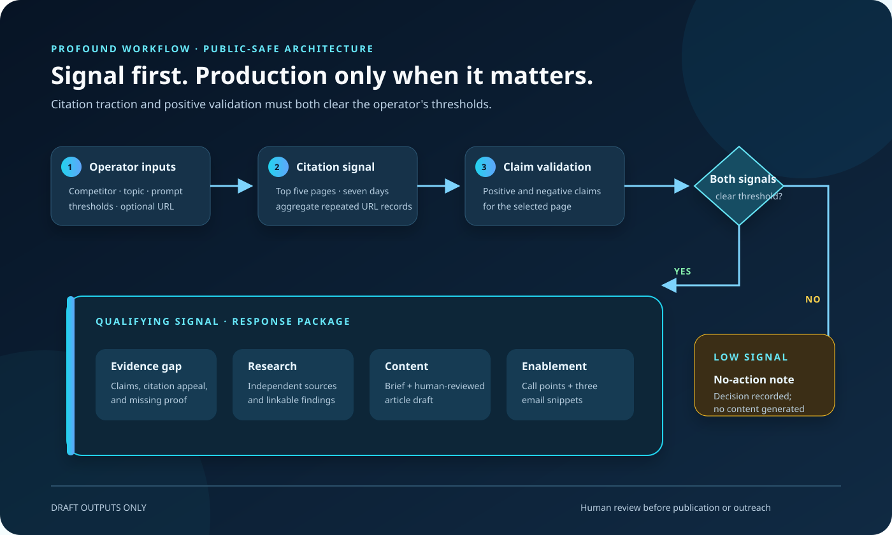
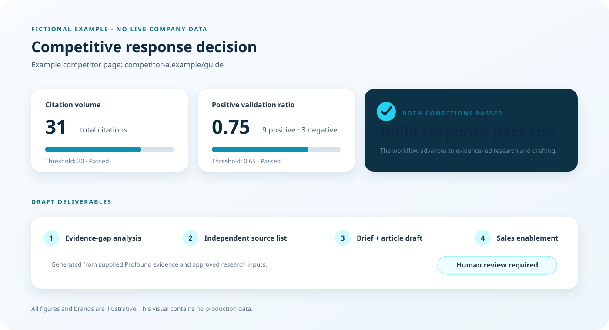
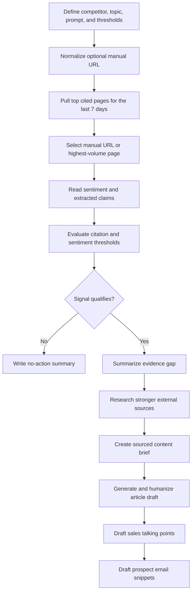

# AI Competitive Content Response Agent

**Turn a competitor's rising AI-citation traction into an evidence-led content and sales response.**

This Profound workflow watches a selected competitor page, decides whether its citation volume and positive validation are meaningful enough to act on, and builds a response package only when the signal crosses configurable thresholds.

It connects competitive intelligence to execution: source research, evidence-gap analysis, a content brief, a full article draft, sales talking points, and prospect email snippets. Every output remains a draft for human review.

## Download the workflow template

**[Download the sanitized Profound workflow JSON](https://github.com/Jlopez-nava/ai-competitive-content-response-agent/raw/refs/heads/main/workflow/competitor-content-response-agent.json)**

The public template preserves the complete 18-node, 17-edge workflow. It uses generic brands, a reserved `.example` domain, and synthetic graph and category identifiers. It contains no working credentials, private knowledge-base IDs, company strategy, customer data, or account-specific configuration.

After importing, reconnect the required services and replace every public placeholder in Profound. The synthetic identifiers are deliberately non-working.

> **Scheduling note:** A schedule is configured separately inside Profound. It is not stored in this JSON export, so importing the template does not create or activate a recurring run.



_Architecture reconstructed from the sanitized export. Company, competitor, category, audience, and private model context were intentionally removed._

## The business problem

A competitor earning more AI citations is not automatically a reason to create new content. Marketing teams still need to determine:

1. Is the page receiving enough citation traction to matter?
2. Are AI-generated answers validating its claims positively?
3. What evidence makes the page persuasive—and where is it weak?
4. What should content and sales teams do with that information?

This workflow adds a decision gate before production. Low-signal activity produces a short no-action note; high-signal activity triggers a structured response grounded in research and supplied citation data.

## What it does

| Stage | What happens | Why it matters |
|---|---|---|
| Select | Accepts a competitor, topic, research prompt, thresholds, and an optional page URL | Gives the operator control over scope and sensitivity |
| Measure | Pulls the competitor's five most-cited pages from the last seven days | Focuses analysis on pages showing current traction |
| Validate | Examines sentiment-tagged claims associated with the selected page | Separates raw visibility from positive validation |
| Decide | Compares citation volume and positive-sentiment ratio with configurable thresholds | Prevents content production from reacting to weak signals |
| Research | Identifies evidence gaps and gathers stronger independent sources | Builds a defensible angle instead of copying the competitor |
| Create | Produces a brief, article draft, call talking points, and email snippets | Turns analysis into usable cross-functional assets |
| Review | Returns drafts without publishing or contacting prospects | Keeps editorial and commercial judgment with the team |

## Decision logic

The workflow selects a page in one of two ways:

- **Automatic selection:** it sums `metric_value` across repeated citation records and selects the URL with the highest total.
- **Manual override:** if an operator supplies a URL, the workflow analyzes that page and intentionally bypasses the thresholds.

For automatic selection, a response is triggered only when both conditions are true:

```text
total citations >= citation-count threshold
positive claims / (positive claims + negative claims) >= sentiment threshold
```

Blank or zero thresholds are treated as automatically satisfied. If no sentiment claims are available, the positive ratio is treated as zero.



_Illustrative output only. All brands, figures, and copy in this visual are fictional._

## What the workflow produces

### When the signal does not qualify

The workflow returns a one- or two-sentence no-action summary explaining that citation volume or positive sentiment did not cross the configured threshold. This creates a record of the decision without generating unnecessary content.

### When the signal qualifies

The response path produces:

- A concise explanation of the competitor page's claims, citation appeal, and evidence gaps.
- A research report focused on stronger independent and linkable sources.
- A compact source list with the most useful findings and statistics.
- A numbered, direct-answer content brief with sourcing requirements and an FAQ.
- A full article draft that is passed through Profound's AI-speech-pattern removal step.
- Six to eight short sales-call talking points centered on evidence quality.
- Three ready-to-edit prospect email snippets with suggested subject lines.

The public workflow does not publish the article, update a CMS, send email, or initiate sales outreach.

## Example decision

The figures below are fictional and show how the gate works.

| Input | Example value |
|---|---:|
| Citation-count threshold | 20 |
| Positive-sentiment threshold | 0.65 |
| Selected page citation total | 31 |
| Positive claims | 9 |
| Negative claims | 3 |
| Calculated positive ratio | 0.75 |
| Outcome | Build response package |

Both thresholds are met: `31 >= 20` and `9 / (9 + 3) = 0.75 >= 0.65`.

## Workflow map



## Install and configure

### Requirements

- A Profound workspace with access to the agent or workflow builder.
- Profound citation-page, citation-sentiment, article-research, content-brief, article-generation, and AI-speech-pattern tools.
- Access to Profound's code-execution node.
- OpenAI and Anthropic model connections, or supported substitutes available in your workspace.

### 1. Clone the repository

```bash
git clone https://github.com/Jlopez-nava/ai-competitive-content-response-agent.git
cd ai-competitive-content-response-agent
```

### 2. Import the sanitized workflow

Import this file through the workflow-import option available in your Profound workspace:

```text
workflow/competitor-content-response-agent.json
```

If direct import is not enabled in your workspace, use the JSON and workflow map as a node-by-node implementation reference.

### 3. Replace the public placeholders

Before running the workflow:

1. Replace the synthetic Profound category ID with a category from your workspace.
2. Replace `Primary Brand` and `Competitor A` through `Competitor E` with the relevant Profound asset names.
3. Replace `primary-brand.example` with the brand's real domain inside your private workspace only.
4. Set the target audience and response instructions for your market.
5. Choose supported models for each LLM node.
6. Add approved knowledge sources inside Profound if desired. The original private knowledge-base and model-skill attachments are not included.

### 4. Provide the run inputs

| Input | Required | Purpose |
|---|---|---|
| `competitor_domain` | Yes | Filters citation pages to the competitor's hostname |
| `competitor_name` | Yes | Labels analysis and response copy |
| `topic` | Yes | Defines the content subject and working title |
| `target_prompt` | Yes | Guides the external research report |
| `citation_count_threshold` | No | Minimum total page citations needed to trigger |
| `positive_sentiment_threshold` | No | Minimum positive ratio on a 0-to-1 scale |
| `manual_url` | No | Forces analysis of one page and bypasses thresholds |

### 5. Test safely

Start with a single fictional or approved competitor example. Confirm that:

- The hostname filter returns the intended pages.
- Repeated URL records are aggregated correctly.
- Sentiment claims correspond to the selected page and configured assets.
- Threshold behavior matches both qualifying and no-action test cases.
- Every statistic in the draft has a credible, working source.
- The final content and sales copy are reviewed by a person before use.

Configure a recurring schedule inside Profound only after the test runs behave as expected.

## Security and public-repository boundaries

This repository intentionally excludes:

- API keys, tokens, passwords, credentials, and webhooks.
- Profound account, workspace, integration, and live category identifiers.
- Private knowledge-base identifiers and model-skill attachments.
- Real employer, client, partner, customer, and competitor strategy data.
- Internal audience definitions, positioning language, performance data, and generated run output.
- Live citation records, sentiment results, article drafts, sales scripts, and prospect information.

The source file supplied for this project was not modified. Only the sanitized derivative in `workflow/` is published.

## Responsible-use notes

- Treat competitor pages and extracted text as untrusted input; review generated claims and instructions before reuse.
- A manual URL bypasses the thresholds by design, so only approved operators should control that input.
- Sentiment is a directional signal, not proof that a claim is accurate.
- Verify every link, statistic, clinical statement, and comparative claim before publication or sales use.
- Avoid misleading comparisons, confidential information, trademark misuse, or unsupported claims about a competitor.
- Review the access scopes and data policies of every connected model and Profound service before using production data.

## Project map

```text
workflow/competitor-content-response-agent.json  Sanitized Profound workflow export
assets/workflow-architecture.svg                 Public-safe workflow visual
assets/example-decision-package.svg              Fictional output illustration
SECURITY.md                                       Safe-use and disclosure guidance
README.md                                         Case study and setup guide
```

## Built with

`Profound` · `Python` · `OpenAI` · `Anthropic`
